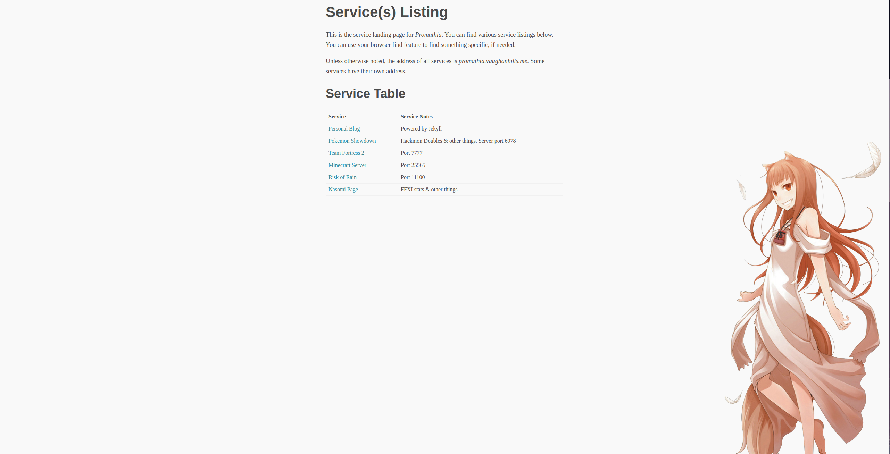

# server-landing-page

A landing page for my server, mostly static assets. 

## Why just an HTML page?

Because it was the simplest thing that worked and does the job. There are no other tools and it's low friction to update and host.

Markdown was also considered but needed a build step.

